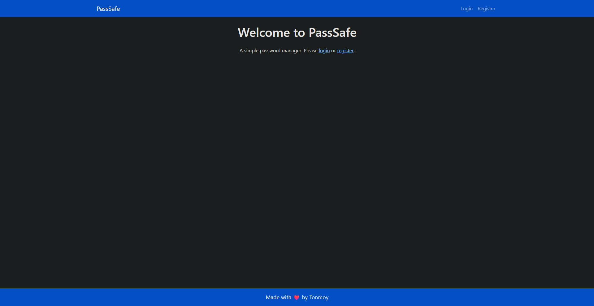
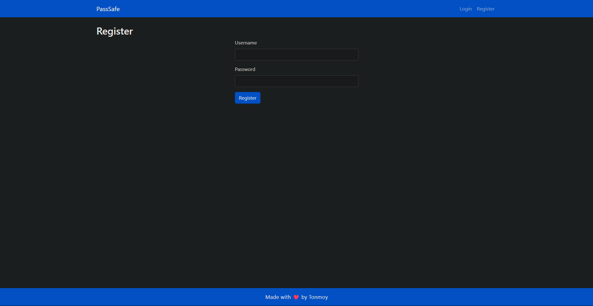
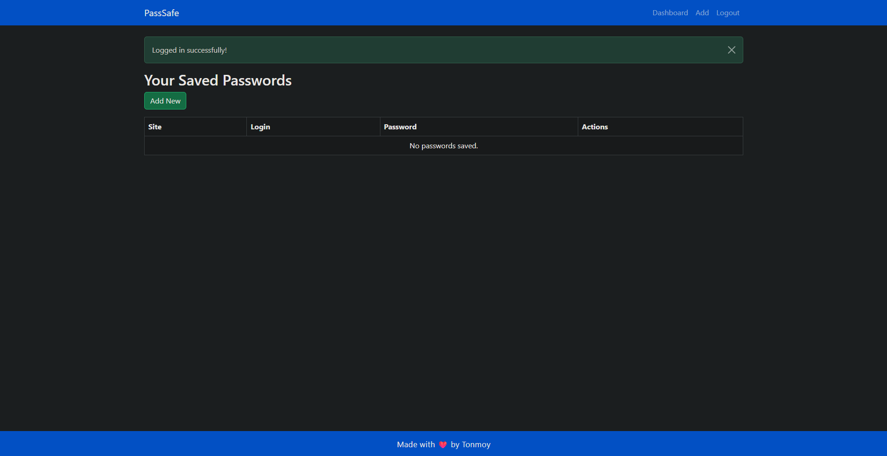
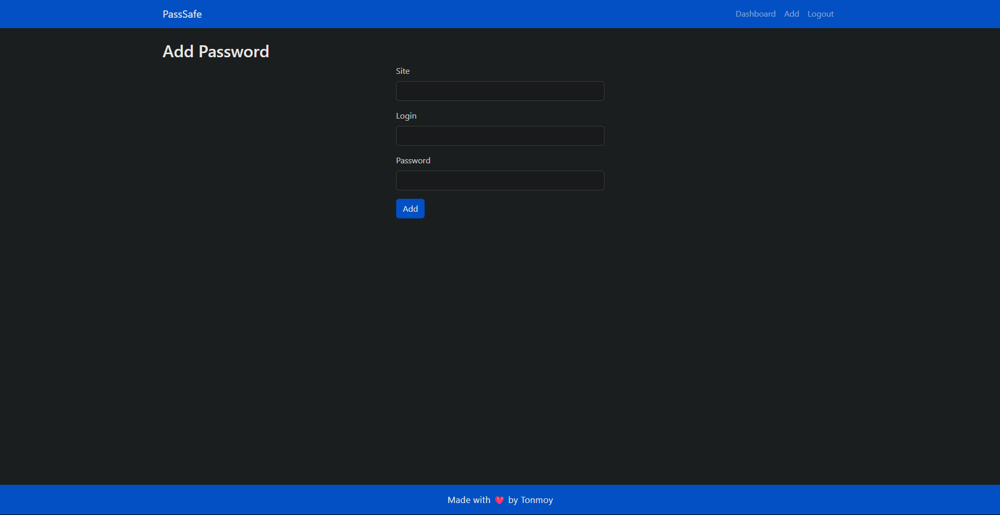
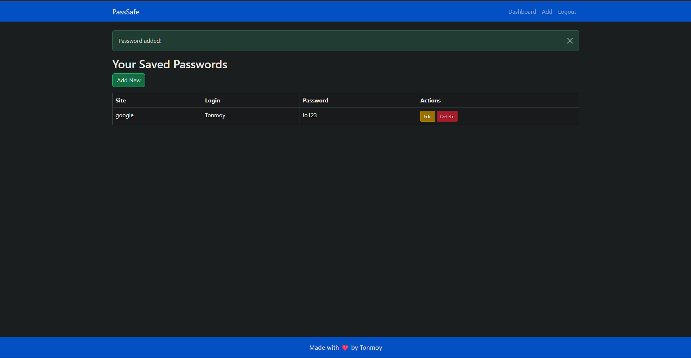

# 🔐 PassSafe - Secure Password Manager

[](https://python.org)
[](https://flask.palletsprojects.com/)
[](LICENSE)
[](https://github.com/yourusername/passsafe)

> 🛡️ A simple, secure, and elegant password manager built with Python Flask

## ✨ Features

- 🔒 **Secure Storage** - Your passwords are safely encrypted and stored  
- 🎨 **Modern UI** - Clean, dark-themed interface for better user experience  
- 👤 **User Authentication** - Secure login and registration system  
- ➕ **Easy Management** - Add, edit, and delete passwords with ease  
- 📱 **Responsive Design** - Works seamlessly on desktop and mobile  
- 🚀 **Fast & Lightweight** - Built with Flask for optimal performance  

## 🎥 Demo

Curious how it works in action?  
Watch the YouTube walkthrough: **[PassSafe Demo](https://youtu.be/K_3QWiA3fGo)**

## 🖼️ Screenshots

### 🏠 Welcome Page


### 📝 User Registration


### 📊 Dashboard - Your Saved Passwords


### ➕ Add New Password


### 📋 Password Management


## 🚀 Quick Start

### Prerequisites
- Python 3.8 or higher
- pip package manager

### Installation

1. **Clone the repository**
   ```bash
   git clone https://github.com/OnoPUNPUN/PassSafe.git
   cd PassSafe
   ```

2. **Install dependencies**
   ```bash
   pip install -r requirements.txt
   ```

3. **Run the application**
   ```bash
   python app.py
   ```

4. **Open your browser**
   Navigate to `http://localhost:5000`

## 🛠️ Tech Stack

- **Backend**: Flask (Python)
- **Database**: SQLite
- **Frontend**: HTML5, CSS3, Bootstrap
- **Authentication**: Flask-Login
- **Templates**: Jinja2

## 📁 Project Structure

```
PASSSAFE/
├── instance/
│   └── passwords.db          # SQLite database
├── static/
│   └── styles.css           # Custom CSS styles
├── templates/               # HTML templates
│   ├── add.html
│   ├── dashboard.html
│   ├── edit.html
│   ├── index.html
│   ├── layout.html
│   ├── login.html
│   └── register.html
├── app.py                   # Main Flask application
└── requirements.txt         # Python dependencies
```

## 🔧 Configuration

The application uses SQLite by default. You can modify the database configuration in `app.py`:

```python
app.config['SQLALCHEMY_DATABASE_URI'] = 'sqlite:///passwords.db'
```

## 🤝 Contributing

Contributions are welcome! Please feel free to submit a Pull Request. For major changes, please open an issue first to discuss what you would like to change.

1. Fork the Project
2. Create your Feature Branch (`git checkout -b feature/AmazingFeature`)
3. Commit your Changes (`git commit -m 'Add some AmazingFeature'`)
4. Push to the Branch (`git push origin feature/AmazingFeature`)
5. Open a Pull Request

## 📝 License

This project is licensed under the MIT License - see the [LICENSE](LICENSE) file for details.

## 🙏 Acknowledgments

- Built with 💙 using Flask
- Icons and UI components from Bootstrap
- Special thanks to the open-source community

## 📞 Contact

**Tonmoy** - [OnoPUNPUN](https://github.com/OnoPUNPUN)

Project Link: [PassSafe](https://github.com/OnoPUNPUN/PassSafe.git)

---

<div align="center">
  <p>Made with ❤️ by Tonmoy</p>
  <p>⭐ Star this repository if you found it helpful!</p>
</div>
